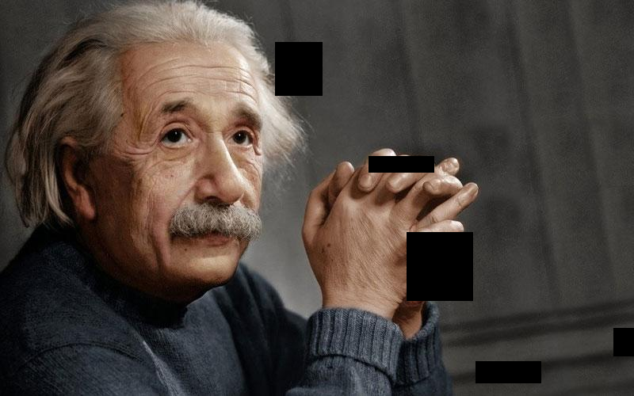
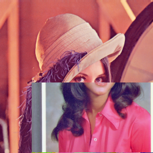
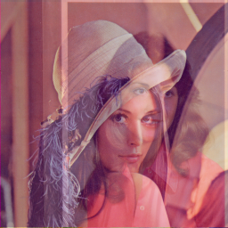

# Augmentation
*A technique to increase the **diversity** of training set by applying random (but realistic) **transformations**.*

This repo contains implemenatation of major data augmentations and dataloaders related to 
- vision(image)
- audio(speech)
- text(language) 

## Dependencies:
- [PyTorch](https://pytorch.org/)
- [opencv-python](https://pypi.org/project/opencv-python/)

---
## Vision
---
### [CutOut](): 
Cutout augmentation is a kind of regional dropout strategy in which a random patch from an image is zeroed out (replaced with black pixels). Cutout samples suffer from the decrease in information and regularization capability.

- Usage:
  ```python
  from vision import CutOut

  cutout = CutOut(num_holes=1, max_h=100, max_w=100, fill_value=0, p=0.5)
  # img: torch image tensor of shape [ch, h, w] 
  augmented = cutout(img)

  # Image level augmentation -> can be used inside custom dataloader
  from torchvision.utils.data import Dataset
  
  class CustomDataset(Dataset):
    def __init__(self, ):
      ...
      self.cutout = CutOut()
      ...

    def __len__(self, ):
      ...
    
    def __getitem__(self, idx):
      ...
      augmented = self.cutout(images[idx])
      ...
      return augmented

  ```

### [MixUP](https://arxiv.org/pdf/1710.09412.pdf)
In Mixup augmentation two samples are mixed together by linear interpolation of their images and labels. Mixup samples suffer from unrealistic output and ambiguity among the labels and hence cannot perform well on tasks like image localization and object detection.

- Usage:
  ```python
  from vision import MixUp

  mixup = MixUp(p=0.5)
  # img: torch batch of image tensor of shape [bs, ch, h, w] 
  augmented = mixup(batch_of_images)

  # Batch level augmentation -> Cannot be used inside Custom loader
  #                          -> Use inside train loop

  for data, target in Dataloader:
    augmented_data, augmentated_target = mixup(data, target)
    ...

  ```

### [CutMix](https://github.com/clovaai/CutMix-PyTorch)
In CutMix augmentation we cut and paste random patches between the training images. The ground truth labels are mixed in proportion to the area of patches in the images. CutMix increases localization ability by making the model to focus on less discriminative parts of the object being classified and hence is also well suited for tasks like object detection.

- Usage:
  ```python
  from vision import CutMix

  cutmix = CutMix(p=0.5)
  # img: torch batch of image tensor of shape [bs, ch, h, w] 
  augmented = cutmix(batch_of_images)

  # Batch level augmentation -> Cannot be used inside Custom loader
  #                          -> Use inside train loop

  for data, target in Dataloader:
    augmented_data, augmentated_target = cutmix(data, target)
    ...
  ```

| | | |
|:-------------------------:|:-------------------------:|:-------------------------:|
| CutOut | CutMix | MixUp |

### [BYOL](https://arxiv.org/pdf/2006.07733.pdf) 
- random cropping: a random patch of the image is selected, with an area uniformly sampled between 8%
- optional left-right flip;
- color jittering: the brightness, contrast, saturation and hue of the image are shifted by a uniformly random
  offset applied on all the pixels of the same image. The order in which these shifts are performed is randomly
  selected for each patch;
- color dropping: an optional conversion to grayscale. When applied, output intensity for a pixel (r, g, b)
  corresponds to its luma component, computed as 0.2989r + 0.5870g + 0.1140b;
- Gaussian blurring: for a 224×224 image, a square Gaussian kernel of size 23×23 is used, with a standard
  deviation uniformly sampled over [0.1, 2.0];
- solarization: an optional color transformation x 7→ x · 1{x<0.5} + (1 − x)· 1{x≥0.5} for pixels with values in [0, 1].
- check [```vision_dataset.py```](./vision_dataset.py)

Usefull links:
- [TORCHVISION.TRANSFORMS](https://pytorch.org/vision/stable/transforms.html)

---
## Audio
---
### [DFT](https://en.wikipedia.org/wiki/Fourier_transform)
- [3Blue1Brown - Explaination of Fourier Transform](https://www.youtube.com/watch?v=spUNpyF58BY)

### [Mel Spectogram]()
### Augmentations
- waveform augmentations
- spectrogram augmentations
### Sample Dataloader

---
## Text
---

## Citations
```bibtex
@misc{grill2020bootstrap,
      title={Bootstrap your own latent: A new approach to self-supervised Learning}, 
      author={Jean-Bastien Grill and Florian Strub and Florent Altché and Corentin Tallec and Pierre H. Richemond and Elena Buchatskaya and Carl Doersch and Bernardo Avila Pires and Zhaohan Daniel Guo and Mohammad Gheshlaghi Azar and Bilal Piot and Koray Kavukcuoglu and Rémi Munos and Michal Valko},
      year={2020},
      eprint={2006.07733},
      archivePrefix={arXiv},
      primaryClass={cs.LG}
}
```

```bibtex
@misc{yun2019cutmix,
      title={CutMix: Regularization Strategy to Train Strong Classifiers with Localizable Features}, 
      author={Sangdoo Yun and Dongyoon Han and Seong Joon Oh and Sanghyuk Chun and Junsuk Choe and Youngjoon Yoo},
      year={2019},
      eprint={1905.04899},
      archivePrefix={arXiv},
      primaryClass={cs.CV}
}
```

```bibtex
@misc{zhang2018mixup,
      title={mixup: Beyond Empirical Risk Minimization}, 
      author={Hongyi Zhang and Moustapha Cisse and Yann N. Dauphin and David Lopez-Paz},
      year={2018},
      eprint={1710.09412},
      archivePrefix={arXiv},
      primaryClass={cs.LG}
}
```
```
@article{Park_2019,
   title={SpecAugment: A Simple Data Augmentation Method for Automatic Speech Recognition},
   url={http://dx.doi.org/10.21437/Interspeech.2019-2680},
   DOI={10.21437/interspeech.2019-2680},
   journal={Interspeech 2019},
   publisher={ISCA},
   author={Park, Daniel S. and Chan, William and Zhang, Yu and Chiu, Chung-Cheng and Zoph, Barret and Cubuk, Ekin D. and Le, Quoc V.},
   year={2019},
   month={Sep}
}
```
