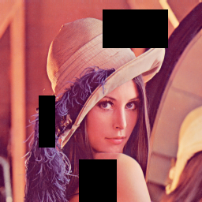

# Augmentation
*A technique to increase the **diversity** of training set by applying random (but realistic) **transformations**.*

This repo contains implemenatation of major data augmentations and dataloaders related to 
- vision(image)
- audio(speech)
- text(language) 

Dependencies:
- [PyTorch](https://pytorch.org/)

## Vision
- Augmentations:
  - [CutOut]()
  - [MixUP](https://arxiv.org/pdf/1710.09412.pdf)
  - [CutMix](https://github.com/clovaai/CutMix-PyTorch)
  ```
        inputs, targets = shuffle minibatch(input, target)
        lambda = Unif(0,1)
        rx = Unif(0,W)
        ry = Unif(0,H)
        rw = Sqrt(1 - lambda)
        rh = Sqrt(1 - lambda)
        x1 = Round(Clip(r x - r w / 2, min=0))
        x2 = Round(Clip(r x + r w / 2, max=W))
        y1 = Round(Clip(r y - r h / 2, min=0))
        y2 = Round(Clip(r y + r h / 2, min=H))
        input[:, :, x1:x2, y1:y2] = input s[:, :, x1:x2, y1:y2]
        lambda = 1 - (x2-x1)*(y2-y1)/(W*H) . Adjust lambda to the exact area ratio.
        target = lambda * target + (1 - lambda) * targets
  ```

| | | |
|:-------------------------:|:-------------------------:|:-------------------------:|
| CutOut | CutMix | MixUp |

- [BYOL](https://arxiv.org/pdf/2006.07733.pdf) Augmentation Dataloader with torchvision
  - random cropping: a random patch of the image is selected, with an area uniformly sampled between 8%
  - optional left-right flip;
  - color jittering: the brightness, contrast, saturation and hue of the image are shifted by a uniformly random
    offset applied on all the pixels of the same image. The order in which these shifts are performed is randomly
    selected for each patch;
  - color dropping: an optional conversion to grayscale. When applied, output intensity for a pixel (r, g, b)
    corresponds to its luma component, computed as 0.2989r + 0.5870g + 0.1140b;
  - Gaussian blurring: for a 224×224 image, a square Gaussian kernel of size 23×23 is used, with a standard
    deviation uniformly sampled over [0.1, 2.0];
  - solarization: an optional color transformation x 7→ x · 1{x<0.5} + (1 − x)· 1{x≥0.5} for pixels with values in [0, 1].

Usefull links:
- [TORCHVISION.TRANSFORMS](https://pytorch.org/vision/stable/transforms.html)

## Audio
## Text

## Citation
```bibtex
@misc{grill2020bootstrap,
      title={Bootstrap your own latent: A new approach to self-supervised Learning}, 
      author={Jean-Bastien Grill and Florian Strub and Florent Altché and Corentin Tallec and Pierre H. Richemond and Elena Buchatskaya and Carl Doersch and Bernardo Avila Pires and Zhaohan Daniel Guo and Mohammad Gheshlaghi Azar and Bilal Piot and Koray Kavukcuoglu and Rémi Munos and Michal Valko},
      year={2020},
      eprint={2006.07733},
      archivePrefix={arXiv},
      primaryClass={cs.LG}
}
```

```bibtex
@misc{yun2019cutmix,
      title={CutMix: Regularization Strategy to Train Strong Classifiers with Localizable Features}, 
      author={Sangdoo Yun and Dongyoon Han and Seong Joon Oh and Sanghyuk Chun and Junsuk Choe and Youngjoon Yoo},
      year={2019},
      eprint={1905.04899},
      archivePrefix={arXiv},
      primaryClass={cs.CV}
}
```

```bibtex
@misc{zhang2018mixup,
      title={mixup: Beyond Empirical Risk Minimization}, 
      author={Hongyi Zhang and Moustapha Cisse and Yann N. Dauphin and David Lopez-Paz},
      year={2018},
      eprint={1710.09412},
      archivePrefix={arXiv},
      primaryClass={cs.LG}
}
```